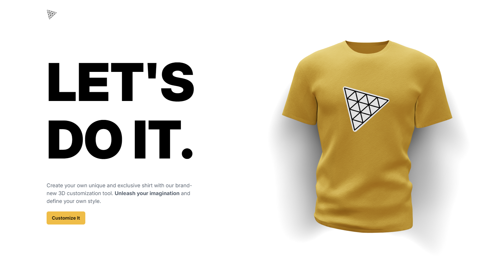

# Three JS & OpenAI T-Shirt Customizer

## Table of Contents

- [Introduction](#introduction)
- [Features](#features)
- [Technologies Used](#technologies-used)
- [Live Demo](#live-demo)

## Introduction

This project is a web-based t-shirt customizing application that allows the users to explore their creativity and display it on a 3D shirt canvas.

## Features

- Change the color of the shirt using a color picker.
- Allows user to upload their own pictures to use them as a logo or a texture for the shirt.
- Prompt AI to generate either a logo or a texture for the shirt.
- Allows user to toggle on and off texture and logo.
- Allows users to download and save their personally customized shirt.

## Technologies Used

- **Frontend:** React, Vite, Tailwind CSS, Valtio.
- **Backend:** Node.js, Express, OpenAI API.

## Live Demo

